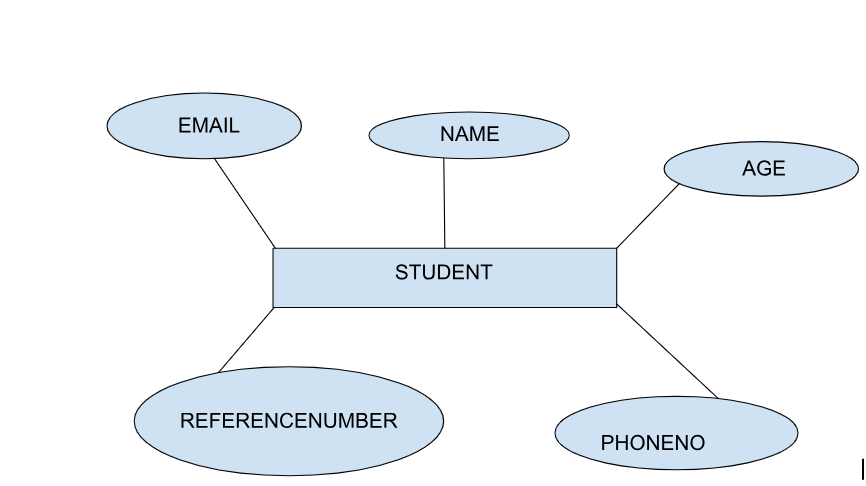
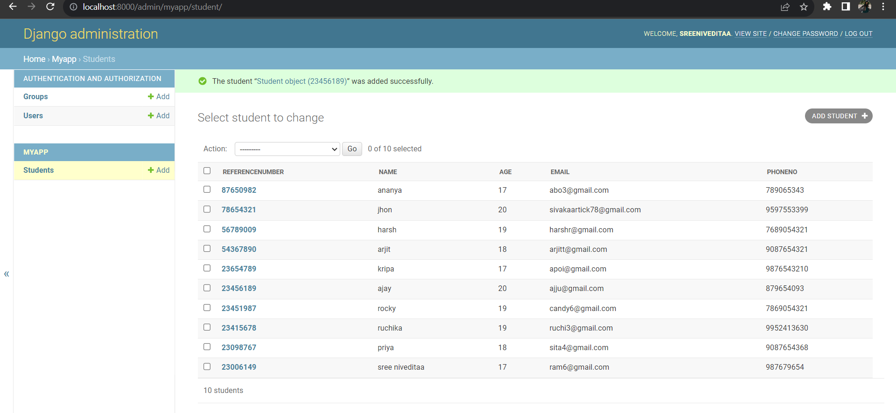

# Django ORM Web Application

## AIM
To develop a Django application to store and retrieve data from a database using Object Relational Mapping(ORM).

## Entity Relationship Diagram



## DESIGN STEPS

### STEP 1:
clone the repository from github.

### STEP 2:
create an admin interface for Django.

### STEP 3:
create an app and edit settings.py

### STEP 4:
Makemigrations and migrate the changes.

### STEP 5:
create admin user and write python code for admin and models.

### STEP 6:
Make all the migrations to 'myapp'.

### STEP 7:
Create a student database with 10 fields using runserver command.

## PROGRAM

```
admin.py

from django.contrib import admin
from .models import Student,Studentadmin
# Register your models here.
admin.site.register(Student,Studentadmin)

models.pyfrom django.db import models
from django.contrib import admin
# Create your models here.
class Student (models.Model):
    referencenumber=models.CharField(primary_key=True,max_length=20,help_text="reference number")
    name=models.CharField(max_length=100)
    age=models.IntegerField()
    email=models.EmailField()
    phoneno=models.IntegerField()


class Studentadmin(admin.ModelAdmin):
    list_display=('referencenumber','name','age','email','phoneno')

    ```

## OUTPUT



## RESULT
The program for creating a student database using ORM is executed successfully